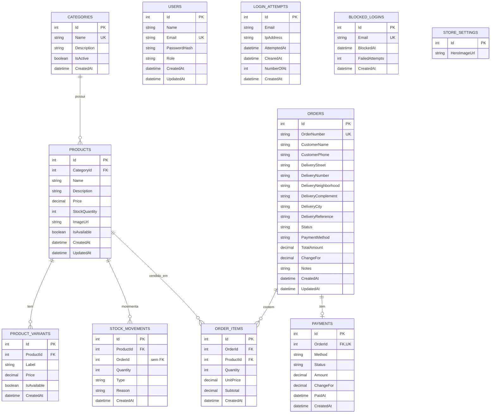

# Modelo de Dados — Bianca Lanches

## Visão geral

O banco de dados utiliza PostgreSQL 16 e é acessado pela API ASP.NET Core com Entity Framework Core e Npgsql. O modelo cobre o catálogo, pedidos, pagamentos, controle de estoque, autenticação administrativa e configurações da loja.

## Diagrama Entidade-Relacionamento

## Regras e decisões do modelo

- A API exige pelo menos um item ao criar o pedido; `ORDER_ITEMS` registra o preço unitário e o subtotal no momento da compra, preservando o histórico caso o preço do produto mude depois.
- `PRODUCTS.StockQuantity` é configurado como token de concorrência para ajudar a evitar inconsistências em atualizações simultâneas de estoque.
- Uma categoria não pode ser removida enquanto houver produtos vinculados; variantes dependem do produto e são removidas em cascata.
- Os itens e o pagamento são removidos em cascata quando seu pedido é removido. Os produtos referenciados por itens ou movimentações não são removidos em cascata.
- O relacionamento entre `ORDERS` e `PAYMENTS` é um-para-zero-ou-um; `PAYMENTS.OrderId` é a chave estrangeira e possui unicidade.
- Categorias, e-mails de usuários, e-mails bloqueados, números de pedido e a combinação produto/identificação de variante têm restrições de unicidade.
- `LOGIN_ATTEMPTS` e `BLOCKED_LOGINS` são trilhas independentes: o modelo não define uma relação por chave estrangeira entre elas nem com `USERS`.
- `STORE_SETTINGS` é uma configuração singleton na aplicação, inicializada com `Id = 1`; não há relacionamento com outras entidades.
- Estados e tipos de domínio são enums na aplicação. Alguns são persistidos como texto pelo mapeamento do Entity Framework Core.

## Fluxo principal

1. Uma categoria agrupa produtos; cada produto pode oferecer várias variantes de preço e disponibilidade.
2. Um pedido guarda os dados de contato e entrega do cliente e possui uma ou mais linhas em `ORDER_ITEMS`.
3. Cada linha aponta para um produto e conserva quantidade, preço unitário e subtotal da compra.
4. A criação do pedido reduz o estoque do produto e registra as respectivas movimentações em `STOCK_MOVEMENTS`.
5. O pagamento acompanha o pedido e pode registrar o método, valor, troco, status e data de quitação.

## Implementação

- **SGBD:** PostgreSQL 16
- **ORM:** Entity Framework Core 8
- **Provider:** Npgsql
- **Contexto:** `AppDbContext`
- **Versionamento do esquema:** migrations do Entity Framework Core
- **Execução local:** container Docker Compose com volume persistente para os dados

> O diagrama representa as entidades e os relacionamentos configurados no código. Regras de negócio e restrições de validação adicionais podem ser aplicadas pela API sem corresponder a uma constraint física do banco.
